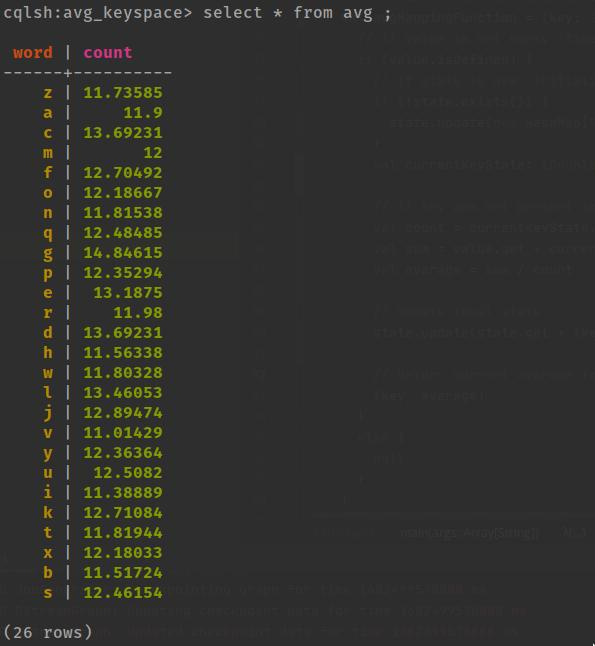

# Spark, Kafka, and Cassandra Integration
The purpose of this project is to develop a Spark Streaming application that reads Apache Kafka's data stream, calculates some results based on the data, and continually stores the result in Cassandra's data warehouse. The input data is <key, value> pairs in the form of <String, Int>, and the goal is to calculate the average value of each key and continuously update it, while new pairs arrive.

## Initialization
### Kafka
As Kafka uses ZooKeeper to maintain the configuration information, we need to start a ZooKeeper server followed by the Kafka server.
```
zookeeper-server-start.sh $KAFKA_HOME/config/zookeeper.properties
kafka-server-start.sh $KAFKA_HOME/config/server.properties
```

Next, we need to create a topic, which is the feed where the messages will be published.
```
kafka-topics.sh --create --zookeeper localhost:2181 --replication-factor 1 --partitions 1 --topic <topic_name>
```
### Cassandra
After that, the Cassandra server must be started. If you want to see the logs in the foreground, you can use the option "-f".
```
$CASSANDRA_HOME/bin/cassandra -f
```
## Programs
### Producer
The first program we are going to start is the generator. This will continuously generate pairs of <String, Int> and feed them to the specified Kafka topic. It generates random letters from the English alphabet followed by a value in the range of [0, 26].

#### Execution
To compile and run it, simply execute the following command replacing <topic_name> with the topic you created at the initialization part when prompt write the number next to the Generator program.
```
sbt "run <topic_name>"
```
### Consumer
#### Code description
First of all, we need to initialize the services we are going to use in addition to Spark. The first step is to create a new Cassandra cluster and connect to it, using the localhost as a contact point. This will result in a session used to create the keyspace <keyspace_name> with the table <table_name> in the Cassandra Server if they do not already exist. Next, we create a Spark configuration with the master in local and from that a Spark Streaming Context every 5 seconds. Finally, we create the Kafka consumer configuration specifying the list of host/port pairs to use for establishing the connection to the Kafka cluster.

After all the services are correctly configured, we subscribe to the topic <topic_name> using the Kafka Spark Streaming Integration approach of the direct stream. Compared with the receiver-based approach, this one ensures stronger end-to-end guarantees. It periodically fetches data from Kafka's topic rather than using receivers. The [main advantages](https://medium.com/@rinu.gour123/apache-kafka-spark-streaming-integration-af7bd87887fb) compared to the traditional approach are simplified parallelism, efficiency and exactly-once semantics.

Several transformations are applied to the stream:
1. Transform the received raw data with the format "String,Int" into pairs <key, value>, which we can use to aggregate by key. If the input data does not have this format, the message will be omitted.
2. Use the mapWithState method that allows us to have a stateful transformation of the stream data accessible from every RDD. In this method, we use a HashMap[String, (Double, Double)] used to store the words and the current count and sum they have. Inside the map function, we are continuously calculating the average between the old key (if it exists) and the new one and with this new value, we both update the state and return it. __Note:__ We calculate the average from the count and sum despite these values could exceed Double size, as it is for academic purpose. The solution could be to reset the count and sum when it exceeds and consider initial value the last average.
3. Write the returned values of the map function to the Cassandra table within its keyspace.

Finally, we start the spark streaming job and we continue the execution until an error occurs or the program is stopped by the user. When this happens, it is important to finalize the Cassandra session.

#### Execution
To compile and run it, execute the following command replacing <keyspace_name> with the keyspace where the table called <table_name> will be created in Cassandra. Also, substitute <topic_name> with the topic you created at the initialization part when prompt write the number next to the KafkaSpark program.
```
sbt "run <keyspace_name> <table_name> <topic_name>"
```

## Outcome
After runnning the program and scanning the Cassandra <table_name> in the <keyspace_name> the results should be similar to:



## Authors
- Serghei Socolovschi [serghei@kth.se](mailto:serghei@kth.se)
- Angel Igareta [alih2@kth.se](mailto:alih2@kth.se)
